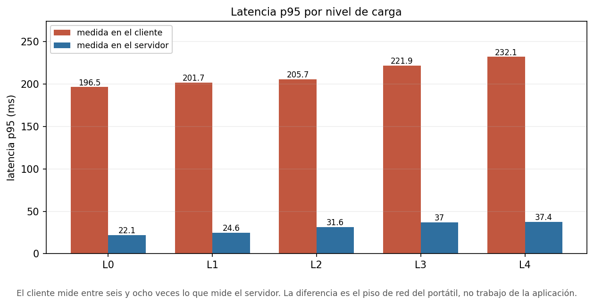
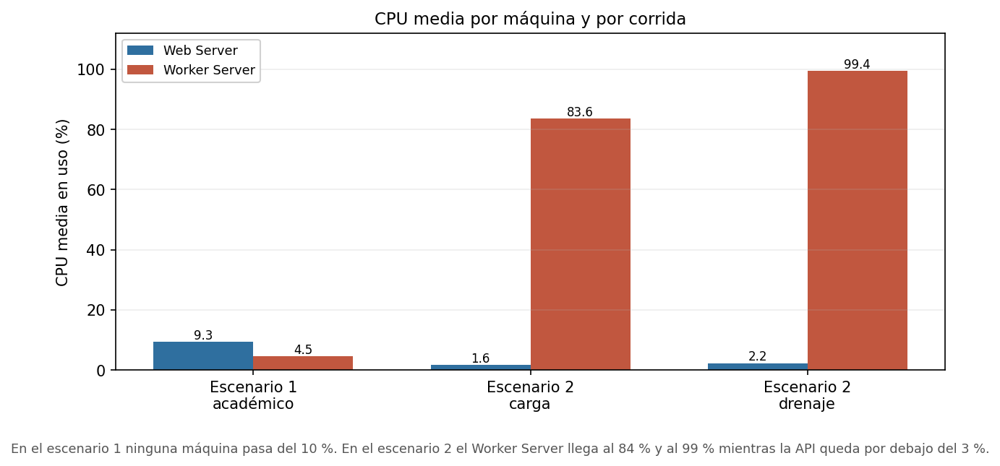
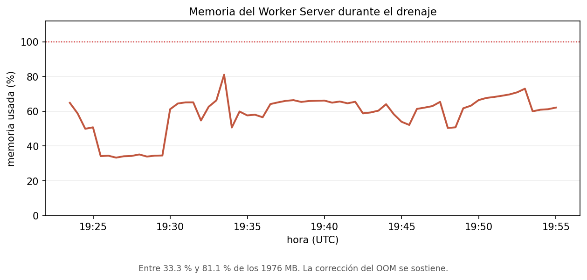
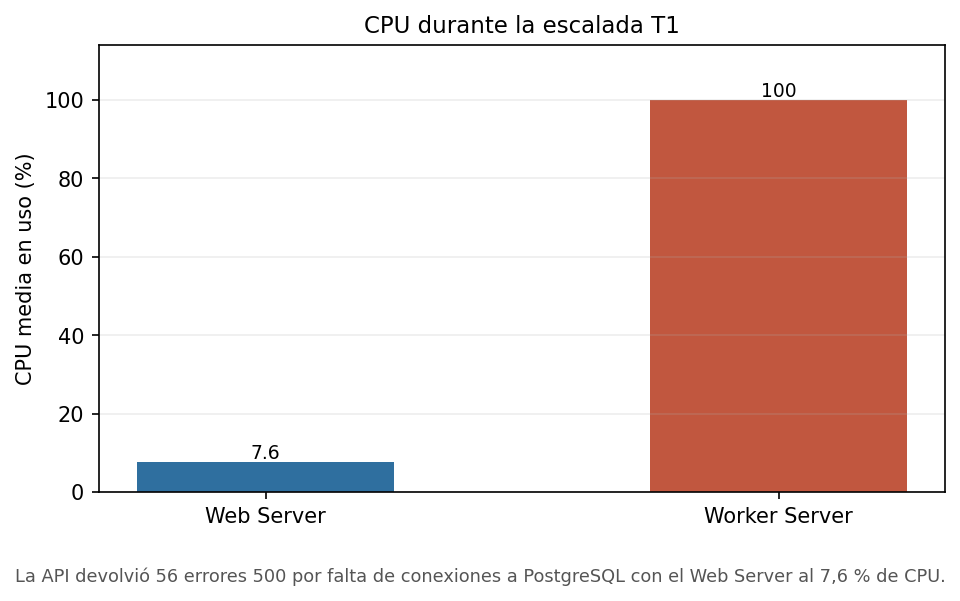
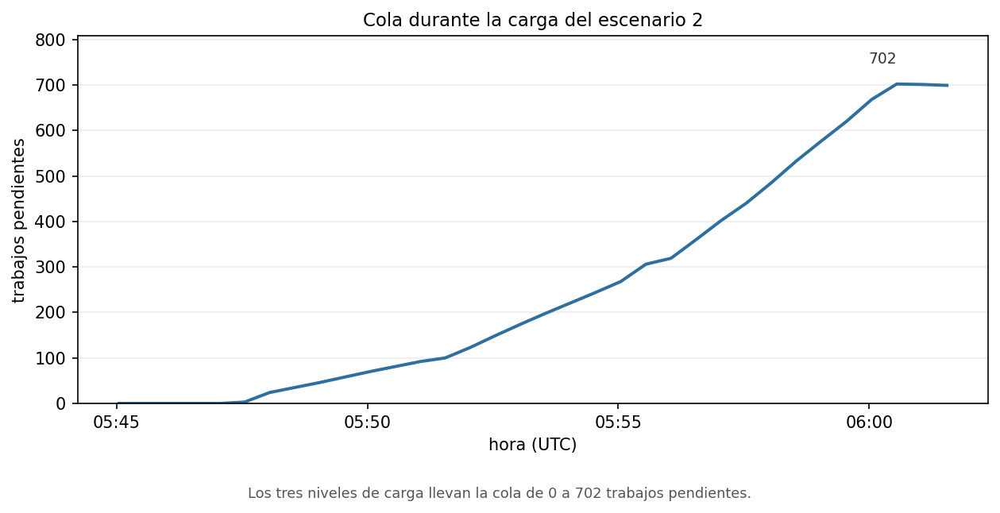
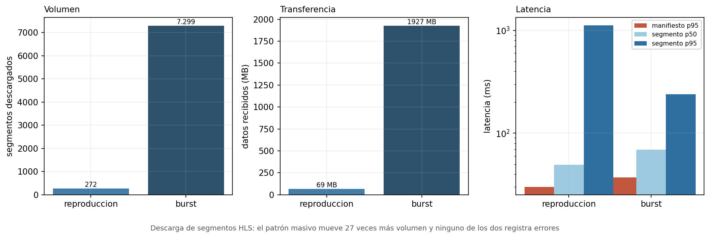
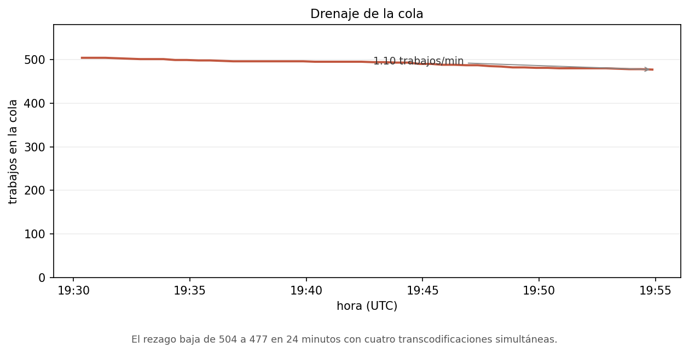

# Análisis de capacidad (Entrega 2)

Plataforma MOOC desplegada sobre Google Cloud, medida con k6 v2.3.0. Las cifras de este documento salen de los archivos de `capacity-planning/results/` y de las series que el Ops Agent dejó en Cloud Monitoring. No hay valores estimados.

El escenario 1 tiene completos sus cinco niveles de actividad académica, la variante de login, la comprobación de integridad y el primer nivel de la escalada por tasa de llegada, que fue el que localizó el primer límite de la API. Del escenario 2 se ejecutaron sus tres etapas (carga, consumo y drenaje). La subida por TUS, la medición del tiempo hasta el primer cuadro y los niveles superiores de la escalada quedan declarados en la sección de limitaciones en lugar de rellenarse con proyecciones.

## Configuración

El despliegue usa dos máquinas `e2-small` (2 vCPU, 1976 MB de RAM utilizable, 30 GiB `pd-balanced`) en `us-central1-a`. El Web Server tiene IP pública `35.255.181.251` y el Worker Server no tiene IP pública. Una tercera VM de la misma familia, `mooc-loadgen`, se aprovisionó como generador y se eliminó al terminar; lo que ocurrió con ella se detalla en las limitaciones. La base de datos es Cloud SQL PostgreSQL 17 sobre `db-f1-micro` con 20 GiB, accesible solo por la IP privada `10.179.0.3`. El almacenamiento son tres buckets de Cloud Storage con interoperabilidad S3. Redis 8.10 y ClamAV corren como contenedores del Worker Server y se acceden por la red privada. El enunciado pide que la cola de mensajería viva en un contenedor dentro de esa máquina, así que la co-localización de Redis con los transcodificadores no fue una decisión nuestra sino un requisito.

El Ops Agent recolecta métricas del host y scrapea `/metrics` de la API en `127.0.0.1:8080` y del worker en `127.0.0.1:9101`, ambos cada 30 segundos. Dejar esos puertos en loopback en vez de publicarlos fue lo correcto, aunque como se ve más adelante no se aplicó en la práctica.

Entre las corridas comparables del escenario 1 se mantuvieron fijos el tipo y tamaño de las tres máquinas, los 4 profesores, los 20 cursos, los 500 estudiantes, la mezcla de operaciones y la configuración de caché (la aplicación no tiene capa de caché). La concurrencia de workers es la excepción. L0 a L4 y la ráfaga de login corrieron con 10, y más adelante se bajó a 4 como ajuste; el antes y el después van separados, como pide el enunciado.

## Metodología

Se usó k6 v2.3.0 por tres capacidades concretas que el enunciado exige. Permite que cada usuario virtual recorra una secuencia válida de operaciones en vez de repetir un endpoint trivial. Separa de forma programática el rechazo de negocio del fallo funcional, que es lo que hace falta para distinguir las solicitudes válidas fallidas de los rechazos esperados por reglas de negocio. Y exporta los resultados de dos maneras, un resumen agregado y un archivo con una línea JSON por muestra que trae marca de tiempo, valor en milisegundos y etiquetas. Esa segunda forma es la que permite recalcular cualquier percentil sin volver a medir.

Los datos de prueba son sintéticos y reproducibles. Se siembran 500 estudiantes, 4 profesores, 20 cursos publicados con 540 recursos y 180 quizzes, más 4 borradores que se usan como escenario de carga, y 2 500 inscripciones que crea el setup de cada corrida. Los cuatro perfiles multimedia se generan con ffmpeg y no se versionan. Son `p1-small` de 854×480 y 30 s, `p2-medium` de 1280×720 y 60 s, `p3-large` de 1920×1080 y 120 s, y `a1-audio` de 180 s, con 5, 10, 20 y 30 segmentos HLS esperados. Los originales se generan directo a su resolución final, sin escalado artificial. Las contraseñas de las cuentas sintéticas se inyectan por entorno y los procesos las leen de Secret Manager, de modo que ninguna queda en el repositorio.

No hay una fase de calentamiento separada, y conviene decir por qué. La corrida no empieza en frío: antes de medir nada, el setup de cada corrida crea las 2 500 inscripciones, de modo que cuando llega el primer nivel medido la API, el pool de conexiones y PostgreSQL ya llevan tráfico encima. Además, el nivel L0 es justamente la línea base de baja carga, con 5 usuarios virtuales, y sirve como primer contacto del sistema con el guion completo. Repetir el calentamiento dentro de la misma máquina habría sido redundante con esa línea base, y en las corridas hechas desde el portátil el propio enlace introduce suficiente latencia como para que el efecto de arranque en frío de la aplicación quede fuera de la ventana medida.

Los criterios con los que se decidió si una corrida sirve son cuatro. El **éxito funcional** se mide con `functional_validation_rate`, que comprueba que cada operación produjo el estado esperado y que un código HTTP correcto no basta por sí solo; una corrida sirve si esa tasa es 1 y el error funcional se queda por debajo del 1 %. La **saturación** se reconoce por dos señales que tienen que aparecer juntas: una máquina en el 100 % de CPU durante la meseta y una cola que deja de drenar, es decir, cuya tasa neta de bajada es cero o negativa. Un pico aislado de CPU no cuenta como saturación. La **degradación** se reconoce por el p95 y el p99 creciendo de un nivel al siguiente mientras la CPU y la cola siguen tranquilas, que es lo que separa una degradación del cliente de una de la plataforma. Y el **criterio de parada** es el abandono al superar el umbral de error funcional, fijado en el 1 %.

## Escenario 1

Cada usuario virtual recorre lo que el enunciado describe como actividad académica: consulta el catálogo paginado y lo ordena, abre el detalle de un curso, consulta el progreso, autoriza la descarga de un recurso, registra avance con heartbeat sobre recursos de texto y de vídeo, presenta un quiz y lo repite hasta agotar intentos, y al final se retira y se reinscribe para ejercitar la reversión de la inscripción. La mezcla incluye lecturas y escrituras, y cada usuario virtual usa una cuenta y un conjunto de intentos distintos para no crear conflictos artificiales.

El login queda fuera del recorrido medido. Los 500 estudiantes se registran e inician sesión durante el sembrado y sus tokens se guardan en el corpus; la corrida medida solo los consume. La razón es técnica y no de comodidad. La verificación de contraseña es bcrypt dentro del request path, así que meter el login en cada iteración mediría el costo de bcrypt y no la actividad académica. El enunciado pide declarar esta decisión y pide además que una ráfaga de inicios de sesión se reporte como variante separada, que es lo que se hace más abajo.

El patrón de inyección es incremental con `ramping-vus`. L0 mantiene 5 usuarios virtuales con 30 segundos de rampa y 2 minutos de meseta. L1 y L2 suben a 15 y 30 con 45 segundos de rampa y 3 minutos de meseta. L3 y L4 suben a 60 y 90 con 1 minuto de rampa y 3 minutos de meseta. Todos bajan en 15 segundos. Entre acciones hay una pausa aleatoria uniforme de 1 a 5 segundos, así que el guion es de bucle cerrado y un usuario virtual no encadena peticiones de forma sintética. La duración efectiva va de 2 minutos 45 segundos en L0 a 4 minutos 30 en L4. El criterio de parada es abandonar por violar el umbral de error funcional, fijado en 1 %, y nunca se alcanzó. L3 se repitió al final para comprobar la estabilidad.

Los resultados de las cinco corridas y la repetición, en milisegundos y con el error funcional medido en el servidor:

| nivel | VU | req/s | p50 | p95 | p99 | máx | err. funcional |
|---|---|---|---|---|---|---|---|
| L0 (base) | 6 | 10.8 | 103.0 | 196.5 | 270.1 | 495.1 | 0 % |
| L1 | 16 | 12.7 | 103.4 | 201.7 | 265.2 | 864.0 | 0 % |
| L2 | 31 | 16.6 | 105.0 | 205.7 | 269.8 | 428.6 | 0 % |
| L3 | 61 | 23.7 | 108.3 | 221.9 | 280.5 | 836.5 | 0 % |
| L4 | 91 | 31.5 | 109.9 | 232.1 | 285.1 | 1269.5 | 0 % |
| L3 (repetición) | 61 | 23.9 | 108.3 | 227.7 | 278.3 | 454.8 | 0 % |

En estas pruebas la plataforma no se degrada de forma apreciable hasta 91 usuarios virtuales. El p50 crece un 6.7 % al cuadruplicar la carga, el p95 un 18 % y el p99 un 5.5 %. El máximo se multiplica por 2.6, pero con dispersión alta y sin monotonía (495 ms en L0, 864 en L1, 429 en L2), lo que apunta a ruido de planificación y no a una tendencia. La repetición de L3 se separa de la original en un 2.6 % del p95 y un 1.8 % del p99, así que la medición se repite dentro del ruido esperado.

Hay dos resultados que parecen contradictorios y conviene mirar aparte. El primero es que `http_req_failed` sube de 0.79 % a 6.79 % a lo largo de los niveles mientras el error funcional se queda en cero. La diferencia está en cómo clasifica el guion y en el desglose por código que expone el servidor. El incremento son 404 sobre `download-url` de recursos de texto y quiz, que no tienen objeto asociado, y el guion los cuenta como rechazo de negocio porque el enunciado pide no contarlos como fallo funcional. Sobre 31 388 peticiones, el desglose da 13 414 inscripciones creadas o repetidas con éxito, 2 826 lecturas de catálogo, 1 797 detalles de curso, 1 385 consultas de progreso y 954 rechazos 404 esperados. Los 2 500 códigos 401 que aparecen en el agregado son del intento fallido que se describe en la sección de incidentes y no de las corridas medidas. No hubo ninguna respuesta 5xx.

La comprobación de integridad bajo concurrencia, que el enunciado pide de forma expresa, también salió bien. La prueba dedicada registra 7 de 7 comprobaciones superadas y tres contadores en cero: doble calificación, intento duplicado y matrícula duplicada. Con 61 usuarios virtuales concurrentes el sistema conserva la integridad de intentos, calificación y progreso, y un envío duplicado no produce doble calificación.

La variante de ráfaga de inicios de sesión, reportada por separado, sí muestra degradación. Sobre 1 687 inicios de sesión a 17.7 por segundo, el p50 es de 626 ms, el p95 de 3 683 ms, el p99 de 5 518 ms y el máximo de 7 697 ms. Que el p95 sea casi 19 veces el p50 no es ruido. La causa es que `AuthenticateUserDetailed` compara la contraseña con `bcrypt.CompareHashAndPassword` dentro del request path y con el coste por defecto, sobre dos vCPU. Es la primera degradación clara de la plataforma y también la que se corrige con una decisión de código y no de infraestructura.

### Aproximación al estrés

Los niveles L0 a L4 usan bucle cerrado, y con una pausa de uno a cinco segundos entre acciones el throughput que producen sale del cociente entre usuarios virtuales y la suma de la pausa y la latencia. Eso sirve para describir la actividad académica, pero no para buscar el límite, porque si la plataforma se pone lenta el generador también afloja. Para acercarse a la saturación se añadió una escalera con inyección abierta, donde la carga la fija un planificador y no el bucle de cada usuario virtual.

La escalera son cinco niveles de tasa de llegada, T1 a T5, con 40, 80, 160, 320 y 640 operaciones por segundo, mesetas de dos minutos y sin pausa entre acciones. La pausa se omite a propósito, porque en inyección abierta no cambia la carga y solo obligaría a mantener más usuarios virtuales vivos para sostener la misma tasa.

El primer nivel ya rompe. Sobre un objetivo de 40 operaciones por segundo:

| medida | valor |
|---|---|
| tasa alcanzada | 25,96 req/s |
| iteraciones descartadas por falta de usuarios virtuales | 1 600 |
| error funcional | 4,87 % |
| rechazo de negocio | 11,26 % |
| `http_req_duration` p50 / p95 / p99 | 242,9 / 1 603,6 / 6 433,1 ms |
| solo respuestas correctas, p50 / p95 | 241,6 / 353,4 ms |
| CPU del Web Server durante la corrida | 7,6 % de media, 20,8 % de máximo |

La plataforma no sostiene ni el nivel más bajo de la escalera. Entrega 26 peticiones por segundo en lugar de 40 y descarta 1 600 iteraciones porque los usuarios virtuales están todos ocupados esperando respuesta. El punto de degradación queda entonces en 40 operaciones por segundo o por debajo, entre los 31,5 req/s que el bucle cerrado sí sostuvo sin errores y la tasa que la escalera no alcanza. Los cuatro niveles superiores quedan pendientes y no cambiarían la conclusión, porque el que falla es el primero. Para localizar el codo con precisión habría que barrer por debajo de 40, no por encima.

La causa de los errores se documenta en la sección de incidentes, y no es el cómputo. El Web Server estaba casi ocioso mientras la API devolvía errores 500.

## Qué limitó la medición del escenario 1

Lo que más condiciona lo que se puede afirmar del escenario 1 es que el generador de carga limitó la medición. Hay tres evidencias. La primera es que el mínimo de `http_req_duration` es de 95 a 96 milisegundos en los cinco niveles, sin excepción. Ese es el piso del camino: el handshake TLS, la ida y vuelta por la red de área amplia y el proxy inverso. La segunda es que el p50 de toda la curva, entre 103 y 110 milisegundos, es casi todo ese piso y no trabajo de la aplicación. La tercera es que el rendimiento por usuario virtual cae de 1.80 a 0.35 peticiones por segundo entre L0 y L4, cuando un servidor que responde en milisegundos debería sostenerlo.

La comparación con el lado del servidor confirma el diagnóstico y muestra dónde está el límite real. El histograma que publica la propia API, con etiquetas por plantilla de ruta, da medias de 0.7 milisegundos para inscripciones, 6.2 para detalle de curso, 7.1 para autorización de descarga, 8.4 para listado de recursos, 12.4 para heartbeat y 36.5 para consulta de progreso. O sea, entre 0.7 y 36.5 milisegundos de trabajo real frente a los 103 que ve el cliente.

El log de acceso de Gin permite ir más allá y medir el servidor por nivel, sin el piso de red. Filtrado por la IP del generador y solo con respuestas 2xx, da estos percentiles:

| nivel | p50 | p95 | p99 | media |
|---|---|---|---|---|
| L0 | 3.5 | 22.1 | 37.8 | 6.5 |
| L1 | 3.6 | 24.6 | 38.5 | 7.0 |
| L2 | 3.7 | 31.6 | 37.1 | 7.7 |
| L3 | 4.3 | 37.0 | 45.8 | 9.4 |
| L4 | 5.0 | 37.4 | 53.2 | 10.3 |

Del lado del servidor el p95 sube de 22.1 a 37.4 milisegundos, un 69 %, mientras que del lado del cliente parece subir solo un 18 % (de 196.5 a 232.1). La degradación existe desde L0, pero el piso de red la atenúa al sumarse a ambas puntas. Este contraste es la razón por la que las cifras del escenario 1 no deben presentarse como capacidad de la plataforma.



*Figura 1. Latencia p95 por nivel, medida en el cliente y en el servidor*

De las dos cosas que el enunciado pregunta sobre la latencia, la respuesta es concreta. La ruta más pesada es la consulta de progreso de curso, con 36.5 milisegundos de media, y la causa es un patrón N+1. El manejador recorre el árbol completo del curso y lanza una consulta por recurso, más otra por cada quiz evaluado. Un curso de quince recursos y cinco quizzes cuesta del orden de veintiún consultas secuenciales. La comparación que lo sostiene está dentro de la misma aplicación: el detalle de curso devuelve un árbol parecido en 6.2 milisegundos. Redis no aparece como cuello de botella en condiciones normales, porque las dos rutas que lo consultan, el login y el health check, responden en el mismo orden que las que no lo hacen. El pool de conexiones de PostgreSQL sí quedó caracterizado después, en la escalada por tasa de llegada, y resultó ser el primer límite de la API. Se detalla en la sección de incidentes.

La consecuencia metodológica es directa. 31.5 peticiones por segundo sobre dos vCPU es una carga trivial, de modo que las cifras del escenario 1 describen al portátil que las generó y no a la plataforma. El enunciado exige verificar que el generador no limite los resultados y en estas corridas esa verificación no se cumple. La VM generadora se aprovisionó justo para esto, y aunque quedó operativa y alcanza al Web Server con una latencia del orden de un milisegundo, los escenarios completos no se pudieron correr desde ella. Las razones están en las limitaciones. Cualquier cifra de capacidad sin esa repetición debe presentarse como máximo probado, que es la redacción que el enunciado contempla para cuando no se alcanza la saturación.

## Métricas de infraestructura

El enunciado pide registrar, junto a los resultados del generador, la CPU, la memoria, la red y el disco de los servidores. Esas cuatro dimensiones se extrajeron de Cloud Monitoring con `capacity-planning/exportar_prometheus.py`, que vuelca cada tipo de métrica por una ventana derivada de la primera y la última marca de tiempo de cada corrida y anota en `manifest.json` la llamada exacta que produjo cada archivo. El volcado son 482 combinaciones de ventana y métrica sin errores y está en `docs/entrega2/evidencia/prometheus/`. Dos decisiones de la extracción importan para leer los números. Las series se piden sin agregación, porque la resolución nativa del scrape ya es de 30 segundos y agregar solo reetiqueta o inventa valores; además `ALIGN_MEAN` no es válido ni para un contador ni para una distribución. Y las distribuciones de los histogramas se exportan en crudo para que los percentiles se puedan recalcular.

La CPU del Worker Server explica el escenario 2. Hay que leer `cpu_state=idle` y usar el complemento, porque `cpu/utilization` llega partido en `guest`, `system`, `wait` e `idle` y mezclar los cuatro da valores sin sentido.

| ventana | Web Server | Worker Server |
|---|---|---|
| escenario 1, curva completa | 9,3 % de media, picos del 99,9 % | 4,5 % de media, picos del 86,1 % |
| escenario 2, etapa de carga | 1,6 % de media, máximo 2,7 % | **83,6 % de media, máximo 100 %** |
| drenaje de la cola | 2,2 % de media, máximo 4,1 % | **99,4 % de media, máximo 100 %** |
| escalada T1 (40 op/s) | 7,6 % de media, máximo 20,8 % | **100 % de media y de máximo** |

En el escenario 1 ninguna de las dos máquinas se acerca a su límite sostenido y la cola estuvo casi vacía, con un máximo de un trabajo pendiente y un segundo de antigüedad, así que el worker no fue el límite del escenario 1. Durante la carga y el drenaje del escenario 2 el Web Server baja al 1,6 % mientras el Worker Server se queda en el 100 % con cuatro ffmpeg consumiendo alrededor del 50 % cada uno sobre dos vCPU. La degradación no es general: la API queda ociosa mientras la transcodificación satura la máquina que la ejecuta. La fila de la escalada T1 es la que mejor lo muestra, porque es la única en la que la API falla: devolvió 56 errores 500 con el Web Server al 7,6 % de CPU, lo que confirma que el límite estaba en otro sitio y no en el cómputo.



*Figura 2. CPU media de cada máquina en las tres corridas*

La memoria del Worker Server durante el drenaje confirma que la corrección del incidente de memoria se sostiene. Filtrando por el estado `used` (la métrica `memory/percent_used` publica una serie por estado y promediarlas no significa nada), la máquina se mueve entre el 33,3 % y el 81,1 %, con una media del 58,4 % sobre 64 muestras de 30 segundos. Nunca se acerca al límite de los 1976 MB. La restricción que queda es de CPU y no de memoria, que es el cambio de naturaleza que buscaba la corrección: antes se perdían trabajos por falta de memoria y ahora se pierde capacidad por falta de CPU sin perder ninguno.



*Figura 3. Memoria del Worker Server durante el drenaje*

La red del mismo volcado resuelve la duda sobre el generador. La tarjeta de red de `mooc-loadgen` registra 0,00 MB por segundo de recepción y de envío en las tres ventanas, porque el tráfico nunca pasó por esa VM y el k6 corría en el portátil. La del Web Server se mueve entre 0,01 y 0,10 MB por segundo. La única interfaz con tráfico apreciable es la del Worker Server, con 1,73 MB por segundo de recepción de media en la etapa de carga, que es la descarga del original desde Cloud Storage para transcodificarlo y no la subida del cliente. La medición de la etapa de carga describe entonces el enlace de subida del portátil.

## Incidentes

### El límite de conexiones de PostgreSQL

Este hallazgo salió de la escalada por tasa de llegada y es el primer límite real de la API. Durante T1 el log del Web Server repetía el mismo error decenas de veces:

```
FATAL: remaining connection slots are reserved for roles with privileges of
the "pg_use_reserved_connections" role (SQLSTATE 53300)
```

La instancia admite **25 conexiones** simultáneas, que es lo que devuelve `SHOW max_connections` en `db-f1-micro`. La aplicación no configura su pool de conexiones: no hay ninguna llamada a `SetMaxOpenConns` ni en `backend/main.go` ni en `backend/worker/main.go`, así que se queda con el valor por defecto de GORM, que no pone tope. Bajo carga la API abre tantas conexiones como peticiones concurrentes tenga, pasa de las 25 que caben y a partir de ahí toda conexión nueva falla.

El desglose por operación de lo que devolvió la corrida deja ver el efecto. Hubo 56 respuestas 500, 42 en el catálogo y 14 en la inscripción, que son las dos rutas cuyos manejadores se vieron en el log sin poder conectar. Hubo además 58 respuestas 403, 37 en la consulta de progreso, 16 en el heartbeat y 5 en el quiz, y el resto de los errores funcionales fueron respuestas 404 en rutas de detalle y de descarga. Las 403 aparecen en rutas autenticadas que dependen de que la inscripción exista, así que la explicación más probable es que la inscripción falló antes y el chequeo posterior rechazó al estudiante por no estar matriculado. Es una hipótesis, no una medición directa.

Lo que descarta que el límite sea el cómputo es la CPU. Durante la corrida el promedio del Web Server fue de 7,6 % y su máximo de 20,8 %. Esa máquina no estaba trabajando; no podía abrir más conexiones a la base de datos. La figura 4 muestra el contraste con el Worker Server, que estuvo al 100 % durante toda la ventana. Esa saturación del worker importa aquí, porque el worker también abre conexiones a PostgreSQL para escribir el estado de los recursos, y compite por los mismos 25 espacios mientras arrastra el rezago acumulado del escenario 2.



*Figura 4. CPU de las dos máquinas durante la escalada T1*

Hay un defecto secundario que aparece en el mismo log y que conviene anotar aparte. Algunas inscripciones fallaron con `violates foreign key constraint "fk_matriculas_student" (SQLSTATE 23503)`, precedidas de un `record not found` en la misma función. La inscripción está referenciando un estudiante que no encuentra en la base de datos, y no es el mismo problema de las conexiones, porque un fallo de conexión no llega a evaluar la clave foránea.

Una limitación de la evidencia merece mención. La métrica `cloudsql.googleapis.com/database/postgresql/num_backends` existe y se puede consultar, pero muestrea cada 60 segundos y durante la ventana reportó entre 4 y 5 conexiones sobre la base `mydb`. No capturó el pico. El agotamiento dura segundos y la resolución de la métrica no lo ve, así que la prueba de este incidente es el log de la aplicación y no la métrica del servicio administrado.

### El OOM del Worker Server

El enunciado anticipa este caso cuando dice que si una dependencia no puede ejecutarse con esos recursos hay que documentar el fallo, el ajuste mínimo aplicado y su efecto sobre costo y capacidad. La evidencia completa está en `docs/entrega2/evidencia/`.

El OOM killer del Worker Server mató a `clamd` a los 538 segundos de arranque, con 913 700 kilobytes de memoria residente, mientras cargaba su base de firmas en una VM de 1 976 MB que además aloja Redis y el worker. Hubo dos consecuencias. La inmediata fue que el escaneo antimalware dejó de existir y, con la política fail-closed de la aplicación, eso bloqueó toda carga. La más interesante fue que la presión de memoria dejó a Redis aceptando conexiones TCP pero sin responder comandos, porque el backlog del kernel encolaba la conexión mientras el proceso no la atendía. La autenticación de toda la plataforma vive en el Web Server y consulta a Redis en cada petición, así que una dependencia caída en una máquina tumbó las sesiones en la otra.

Los números del incidente están desglosados en la evidencia. El endpoint de salud, que es el único que consulta Redis, pasó de 200 en 0.4 segundos a 500 en 5.4 segundos. Una ruta autenticada cualquiera pasó de 200 a 401 tras entre 2 y 20 segundos, porque la resolución de sesión contra Redis agotaba su tiempo de espera y el fallo se reportaba como token inválido. El puerto 3310 de ClamAV estaba cerrado, mientras que el de Redis aceptaba conexiones y el de Cloud SQL respondía con normalidad, lo que descartó de inmediato un problema de red o de firewall entre máquinas. Sobre 43 995 respuestas registradas en una ventana de catorce horas del log de la API, 41 567 fueron 2xx, 2 259 fueron 4xx rápidos que corresponden a rechazos de negocio y 166 tardaron entre 2 y 20 segundos, de los cuales 152 fueron 401 y 14 fueron 500. No hay otra combinación de código y latencia en todo el log, así que la atribución no deja dudas.

Tres medidas formaron el ajuste mínimo, todas dentro de la misma configuración de 2 GiB para no invalidar las corridas ya capturadas. La primera es un límite de memoria por contenedor, 1 200 MB para ClamAV, 256 MB para Redis y 1 024 MB para el worker. Sin límites el núcleo elige víctima y eligió a `clamd`; con límites muere el culpable y la política de reinicio lo levanta sin arrastrar a Redis. La segunda es un tope de memoria para Redis con política de desalojo por proximidad a expiración. Redis no tenía tope y podía tumbar la VM por su cuenta, y como todas las claves de sesión llevan tiempo de expiración, desalojar la más próxima a caducar es la política correcta. La tercera son 2 GiB de swap creados en el arranque del worker, que hacen que el pico de carga de la base de firmas deje de ser mortal.

Estas medidas no mejoran el rendimiento. Su valor está en evitar que un pico de arranque destruya la plataforma. El incidente siguiente sí tiene efecto medible sobre capacidad.

### La concurrencia no cabía en 2 GiB

Este hallazgo es independiente del anterior y es el que más afecta la capacidad del escenario 2. Con concurrencia 10, el worker lanza diez transcodificaciones a la vez. Cada ffmpeg procesando 1080p consume alrededor de 102 MB, así que el contenedor retiene 1 017 MB solo en ffmpeg. Sumando clamd, que fluctúa entre 320 y 850 MB según la base de firmas que tenga cargada, y el propio proceso Go, la cuenta llega a 2 297 MB frente a 1 976 disponibles. El déficit es de 321 MB, y el resultado es que el gestor de memoria del núcleo mata los ffmpeg con señal de terminación, cada recurso queda en estado de fallo y la cola se llena de tareas archivadas. El consumo estaba en la etapa de codificación, no en el escaneo antimalware, que pasaba sin problema.

Con clamd en su pico, el presupuesto de memoria muestra que la palanca es la concurrencia y no el límite del contenedor. Subir el límite no resolvería nada, porque el déficit está en el total de la máquina y no en un contenedor aislado. Con concurrencia 5 el total estimado es de 1 790 MB, con 4 es de 1 688 MB y con 3 de 1 586 MB. Se bajó la concurrencia a 4, lo que deja 288 MB de margen para el pico de ClamAV, y además se dejó declarada de forma explícita en la configuración en vez de heredarla de un valor por defecto, porque el enunciado pide registrar la concurrencia de workers en cada corrida.

Sobre la capacidad el efecto es directo. El drenaje de la cola se alarga porque se procesan menos trabajos a la vez. Ese es justamente el número que el escenario 2 debe reportar. La plataforma antes procesaba más trabajos por segundo y perdía la mitad; ahora procesa menos y no pierde ninguno.

De aquí sale además la observación de arquitectura más útil del análisis. ClamAV retiene entre 320 y 850 MB de forma permanente, hasta un 43 % de la máquina en su pico, para servir un escaneo que ocurre una sola vez por carga. Ese consumo es la razón directa de que la concurrencia tenga que ser 4 y no 10. Es un costo del control de seguridad que el enunciado exige y que compite con la etapa de procesamiento, y por eso la evolución natural es mover el escaneo fuera de la máquina que transcodifica, no añadir cómputo.

### Redis y la CPU del worker

Durante la carga del escenario 2, con la cola creciendo, planteamos la hipótesis de que el worker saturado al 100 % de CPU retrasaba las escrituras en Redis, que vive en la misma máquina, y con eso la respuesta de la API. La medición la refuta. Con el host al 0 % de ociosidad, 60 % de tiempo de usuario y 40 % de sistema, y una carga de 11 sobre 2 vCPU, la latencia de Redis medida en el propio worker por localhost es de 0.054 milisegundos la mínima, 0.696 la máxima y 0.169 de media sobre 27 muestras. Redis no sufre inanición. Desde el exterior, las rutas que consultan Redis no son más lentas que las que no lo hacen: 0.44 segundos de media para el health check, 0.66 para la ruta autenticada y 0.43 para el catálogo, todas dominadas por el piso de red del portátil. Un PING de Redis son unos 50 microsegundos de trabajo, así que los ffmpeg reclaman la CPU que necesitan y se la llevan sin que Redis lo note.

Queda un acoplamiento real, pero por otro canal, la memoria, y el incidente del OOM lo demuestra. Esta máquina es segura frente a la contención de CPU y frágil frente a la de memoria. Si se aumenta la presión de transcodificación, el riesgo es que el gestor de memoria lo mate y que con él se caiga la autenticación de toda la plataforma, que vive en otra VM. Que Redis se ponga lento no es lo que se midió. Las tres mitigaciones aplicadas atacan ese canal.

## Escenario 2

### Carga

Se ejecutaron los tres niveles de carga directa con 3, 5 y 9 usuarios virtuales. La validación funcional está bien: 388 subidas aceptadas en el nivel más alto, 881 MB transferidos, cero transferencias fallidas, cero identificadores de tarea vacíos, cero errores funcionales y 428 de 428 comprobaciones superadas.

Los resultados reproducen la limitación del escenario 1 y con más claridad. La tasa de transferencia es de 2.15, 2.16 y 2.16 MB por segundo en los tres niveles, casi constante mientras la carga se triplica. Eso es el techo del enlace de subida del portátil y convierte la etapa de transferencia en una medición de la conexión doméstica y no del sistema. La latencia de transferencia medida en el cliente sube de 1 359 a 1 698 milisegundos en el p95, y la latencia desde el inicio de la acción hasta la confirmación de la subida sube de 1 596 a 2 812 milisegundos, porque incluye la transferencia y el tráfico de control. La señal útil es otra. La latencia de creación de recurso, que es tráfico de control puro contra la API, sube de 322 a 482 milisegundos en el p95, un 50 % al triplicar la carga, y eso sí es comportamiento de la plataforma. La cola crece de 71 a 605 trabajos, con la antigüedad del más viejo de 132 a 494 segundos, mientras los trabajos activos se mantienen exactamente en 4, que es la concurrencia configurada.



*Figura 5. Cola durante los tres niveles de carga del escenario 2*

La etapa aporta dos cosas utilizables y una inutilizable. Sirve la saturación del worker con la cola creciendo, que es lo que sostiene el hallazgo del drenaje. Sirve también la degradación del 50 % en el tráfico de control al triplicar la carga, que es una pista sobre el comportamiento de la API bajo presión. No sirve la tasa de transferencia, y por eso la repetición desde `mooc-loadgen` es aquí más necesaria que en el escenario 1: es la única forma de que esa medición signifique algo.

### Carrera en la autorización de carga

Un defecto de diseño de la ruta de carga directa condiciona toda la etapa de procesamiento. El endpoint que emite la URL prefirmada encola el trabajo de escaneo antimalware y devuelve la URL en la misma respuesta. El cliente solo sube los bytes después de recibir esa URL, así que el worker puede recoger el trabajo de escaneo antes de que el objeto exista en el almacenamiento. El primer intento falla entonces con el error de clave inexistente y el trabajo solo se procesa en el reintento, tras el primer ciclo de espera de 30 segundos.

La evidencia es que el archivo de 670 KB ganó la carrera y los otros tres la perdieron, y que la tasa de fallo del día llega a 37 sobre 93 procesados, un 40 %. Cada subida consume un intento y añade unos 30 segundos de artefacto entre que termina la transferencia y arranca el escaneo. Eso contamina justo la magnitud que el enunciado pide reportar, el tiempo desde la carga completa hasta el estado disponible, con una constante que es efecto de la carrera y no latencia del pipeline. Esa cifra, tal como está, no es comparable con nada.

La corrección de fondo es separar la autorización de la confirmación, de modo que el endpoint de URL prefirmada solo autorice y que un endpoint de confirmación encole el escaneo una vez que el cliente recibió la respuesta de la subida. Ese endpoint es además la tercera medición que el enunciado exige para el escenario 2 y que hoy no existe, el tiempo de confirmación de la carga completa; el guion actual lo reconoce en un comentario y lo sustituye por una relectura del recurso. Hay también un defecto en la clave de idempotencia, que es el identificador estable del recurso y por tanto el mismo para todos los intentos de subida del mismo recurso, lo que hace que una resubida dentro de las 24 horas descarte su escaneo en silencio. Es fail-closed, porque el recurso queda pendiente y no puede publicarse, así que no es un agujero de seguridad, pero confunde.

### TUS

La subida reanudable falla contra el endpoint S3 de Cloud Storage con un error de firma no coincidente al crear la subida multiparte. La comparación es útil: la carga directa por URL firmada, que usa otra biblioteca, funciona, y ambas comparten la misma clave HMAC y la misma región. La interoperabilidad S3 de Cloud Storage no es total y la biblioteca de firma de la ruta TUS no habla con ella en operaciones multiparte. El enunciado exige carga directa al almacenamiento de objetos y esa vía funciona; TUS es un añadido de la entrega anterior y no un requisito de esta, así que la entrega se sostiene sin él y la incompatibilidad queda como hallazgo documentado y como experimento pendiente de cuantificar.

### Consumo HLS

El corpus de medios quedó completo con cuatro perfiles, todos transcritos y publicados: 854×480 de 30 segundos con 3 segmentos, 1280×720 de 60 con 6, 1920×1080 de 120 con 12, y un perfil de solo audio de 180 segundos con 31. Los segmentos no se asumieron, se leyeron de cada manifiesto ya publicado, y su duración real es de 10,42 segundos en vídeo y 6,01 en audio, que es el corte de 6 segundos del worker salvo el primer segmento de cada uno, algo más largo por el desplazamiento acumulado. El original de 1920×1080 produce una sola rendición de 720p porque el worker escala a la baja con `min(ih,720)` y no hay upscale en ninguna parte del proceso.

El enunciado pide que las descargas representen la cadencia de reproducción declarada y que el patrón de descarga masiva se identifique por separado. Se ejecutaron los dos, porque no son la misma medición.

| patrón | segmentos | throughput | datos | latencia de segmento p50 | p95 | errores |
|---|---|---|---|---|---|---|
| `reproduccion` | 272 | 0,92 /s | 68,6 MB | 49,3 ms | 1.120 ms | 0 |
| `burst` | 7.299 | 25,51 /s | 1,93 GB | 69,4 ms | 239 ms | 0 |

Ninguno de los dos registra errores funcionales, y en ambos el plano de control es rápido: el manifiesto se resuelve con 10,6 milisegundos de mediana y 30,2 en el p95, y la autorización de la URL de descarga tarda 11,0 y 92,4 milisegundos. Lo que más importa es la diferencia de 27 veces en segmentos y 29 en bytes entre un patrón y el otro. Cualquier cifra de consumo citada sin decir cuál de los dos es no significa nada.



*Figura 6. Segmentos descargados en cada patrón de consumo*

La aparente contradicción de que el patrón suave tenga peor p95 de segmento, 1.120 milisegundos frente a 239, tiene explicación. En el patrón de reproducción el segmento se pide justo cuando el reproductor lo necesita, así que cada espera coincide con una conexión nueva hacia Cloud Storage y con el primer segmento de la rendición, que es el más largo. En el patrón masivo las conexiones se reciclan y las peticiones se solapan, así que la latencia por petición baja aunque el throughput suba. La lectura honesta es que la cadencia de reproducción no satura el almacenamiento, y que los 1,93 GB a 6,7 MB por segundo del patrón masivo indican que el sentido de descarga del enlace del portátil no tiene el techo de 2,16 MB por segundo que se midió en el sentido de subida. Ese límite es de subida y no del enlace completo.

### Drenaje

El drenaje se observó sobre los objetos de la corrida de carga `r1790487999`, que dejó 616 trabajos pendientes. El guion muestrea la cola cada 10 segundos, consulta el estado de cada recurso por su identificador y da la cola por drenada cuando pendiente y activo llevan tres muestras seguidas en cero. En la ventana de 20 minutos registró 200 recursos que pasaron a `ready`, ninguno en `failed`, y seis muestras consecutivas sin cumplir el criterio de estabilidad, con la profundidad en 613 de mediana y 616 de máximo. La cola no convergió, y no lo va a hacer. La razón está en la tasa de procesamiento, que se puede medir en el log del worker sin depender de cuánto dure la observación.

Cada transcodificación terminada deja una línea con marca de tiempo en el log del worker. Separando los periodos en los que el worker trabajó de verdad de las paradas de las máquinas, quedan dos tramos continuos independientes, de 84,8 minutos con 101 trabajos y de 17,6 minutos con 17 trabajos. La tasa es de 1,19 y 0,97 trabajos por minuto, y la mediana del intervalo entre trabajos terminados es de 38 segundos, que equivale a 1,58 por minuto. El agregado de los dos tramos da 118 trabajos en 102,3 minutos, es decir **1,15 trabajos por minuto**. Esa es la capacidad de procesamiento de esta configuración. Es un ritmo y no un máximo, así que no hace falta medir más tiempo para sostenerla.

Ese mismo número sale por otra vía, las métricas del Ops Agent, y sirve de contraste. El rezago total, que suma pendientes, activos y reintentos, bajó de 504 a 477 en 24 minutos, es decir 1,10 trabajos por minuto. Conviene mirar el rezago y no los pendientes sueltos, porque cuando un reintento expira pasa de la bolsa de reintentos a la de pendientes y el conteo de pendientes da un salto que no es trabajo nuevo. Las dos mediciones, 1,15 por el log y 1,10 por las métricas, coinciden.

El enunciado pide separar el tiempo de espera en cola, la duración del procesamiento y el tiempo desde la carga completa hasta el estado disponible. Las dos primeras no se pueden separar con las mediciones que hay, y conviene explicar por qué en lugar de dar una cifra que no está medida. El worker registra cuándo termina una transcodificación, pero no cuándo la empieza, así que el log da la tasa de completado y no la duración de cada trabajo. El tiempo desde la carga completa hasta `available` sí está medido, y está medido como una sola cifra que contiene las dos cosas: la espera en la cola más el tiempo de procesamiento. Sobre un rezago acumulado de cientos de trabajos esa suma está dominada por la espera, así que ni siquiera sirve como estimación del procesamiento.

Lo único que se puede afirmar sobre la duración del procesamiento es una deducción, y la doy como tal. Con cuatro trabajos activos de forma sostenida y una tasa de completado de entre 1,10 y 1,58 trabajos por minuto, la ley de Little sitúa el tiempo medio que un trabajo ocupa un espacio del worker entre 2,5 y 3,6 minutos. Es una deducción a partir de dos cantidades medidas, no una medición directa. Para tener la cifra real habría que instrumentar el worker con una línea al empezar cada transcodificación, que es un cambio de una línea en `backend/worker/handlers_media.go` y no se hizo en esta entrega.



*Figura 7. Drenaje de la cola*

Con alrededor de 490 trabajos de rezago en el momento de la medición, la proyección es directa:

| tasa | tiempo restante estimado |
|---|---|
| 1,58 trabajos/min (mediana de intervalo) | 5,1 h |
| 1,15 trabajos/min (agregado de ambos tramos) | 7,1 h |
| 0,97 trabajos/min (tramo más reciente) | 8,4 h |

Lo que importa es el orden de magnitud, entre cinco y ocho horas y media para vaciar la cola, con cuatro transcodificaciones a la vez y dos vCPU. La comparación con la carga cierra el diagnóstico. El nivel más alto del escenario 2 aceptó 388 subidas en unos ocho minutos, del orden de 48 llegadas por minuto, de modo que la cola crece unas 42 veces más rápido de lo que se vacía. Con la configuración fija y sin escalado, la capacidad sostenible de la transcodificación está entre uno y dos trabajos por minuto, y cualquier nivel de carga por encima de esa cifra acumula rezago.

Esto responde la pregunta que el enunciado hace explícita, sobre si un HTTP de aceptación equivale a una transcodificación exitosa. No. De los 388 trabajos que la etapa de carga aceptó, ninguno llegó a completarse dentro del presupuesto de medición. El tiempo hasta `available` que reporta el guion, con 48,98 millones de milisegundos de mediana, no es tiempo de procesamiento. Es la espera acumulada en la cola desde que el objeto se encoló hasta que el observador lo vio listo, y su tamaño demuestra que el punto donde se rompe la capacidad está en la cola, no en otra parte del recorrido. Para obtener un tiempo de procesamiento real habría que medir una carga pequeña sobre una cola vacía, porque sobre un rezago así la espera domina cualquier otro término.

En la contabilidad de fallos hay un artefacto que conviene separar. Tras la ventana de medición se detuvieron y reiniciaron las máquinas para dejar de consumir crédito, y el reinicio mató cuatro transcodificaciones a mitad. Esos trabajos aparecen después como fallidos y reintentados, y por eso el contador de fallos del worker subió de 677 a 1186 en ese momento. Son consecuencia de la parada y no de la plataforma bajo carga, y no deben contarse como tasa de fallo. Un punto positivo de la misma observación es que no quedó ningún trabajo archivado, porque el sistema conserva el estado fallido diagnosticable en lugar de perderlo, que es lo que el enunciado pide verificar.

### Qué limita el flujo y qué lo cambiaría

El componente que limita el flujo del escenario 2 es la etapa de transcodificación del Worker Server, y la segunda restricción es el número de conexiones de PostgreSQL, que aparece antes incluso de que la transcodificación se sature. El almacenamiento de objetos no limita: en las 7 571 descargas de segmentos y manifiestos del consumo no hubo un solo error, la autorización de descarga tarda 11 milisegundos de mediana y 92 en el p95, y el manifiesto se resuelve en 10,6 y 30,2. Las operaciones contra el bucket son las más rápidas del recorrido, no las más lentas.

De ahí sale la conclusión sobre la CDN, que el enunciado pide y que conviene dar con la evidencia delante. Una CDN acorta el tramo entre el almacenamiento y el estudiante, que es justo el tramo que en estas pruebas no dio problemas y que además se midió por debajo del techo del enlace del portátil: 1,93 GB a 6,7 MB por segundo en el patrón de descarga masiva. Poner una CDN delante del bucket mejoraría la latencia de segmento del usuario remoto y bajaría el egreso del bucket, y eso tiene valor de costo y de experiencia, pero no movería el cuello de botella, porque el cuello está después de la descarga. La aplicación ya tiene el punto de configuración previsto, la variable `CDN_BASE_URL` en el archivo de entorno, así que el cambio sería de configuración y no de código. Lo que sí movería el cuello es más capacidad de procesamiento, que es el otro término que el enunciado menciona.

Sobre la concurrencia de transferencias al almacenamiento conviene ser preciso, porque el ajuste tiene un efecto distinto según el tramo. La subida directa la controla el cliente y no el servidor, y en estas pruebas quedó clavada en 2,16 MB por segundo por el enlace del portátil, así que aumentar la concurrencia de subida desde el servidor no aplica: el servidor no participa en esa transferencia. La bajada sí es del servidor, y ahí el worker descargó el original y subió los derivados con la NIC en 1,73 MB por segundo de recepción de media en la etapa de carga. Subir la concurrencia de transferencia del worker tendría sentido si el bucket fuera el limitante, pero no lo es, y de hecho el worker ya comparte su CPU con ffmpeg y con ClamAV, de modo que más transferencias simultáneas competirían con la codificación en lugar de ayudarla. El ajuste que sí cambiaría algo es el opuesto: separar el proceso de transferencia del de codificación para que ninguno espere al otro.

## Limitaciones

La limitación más importante sigue siendo el generador. Las cinco corridas del escenario 1, los tres niveles de carga del escenario 2 y las dos del consumo se ejecutaron desde un portátil, y el generador limitó la medición. La evidencia es directa: la tarjeta de red de `mooc-loadgen` se mantuvo en 0,00 MB por segundo de recepción y de envío durante toda la sesión, porque el tráfico nunca pasó por esa máquina, mientras que la del Web Server se movió entre 0,01 y 0,10 MB por segundo. El servidor recibió como máximo una centésima parte de lo que el cliente dijo enviar. La repetición desde `mooc-loadgen` es un requisito pendiente y no una mejora. Una medición propia desde esa VM, todavía preliminar y fuera de las ventanas del informe, da latencias internas del orden de 1 milisegundo frente a los casi 100 del portátil, lo que confirma cuánto pesa el piso de red.

Las pruebas no se pudieron completar desde `mooc-loadgen` y conviene dejar las razones por escrito, porque el enunciado pide verificar que el generador no limita los resultados y esa verificación no se cumplió. La máquina quedó operativa: clona el repositorio, instala k6 y go-task y alcanza al Web Server por la red privada. Lo que no se pudo fue correr los escenarios completos desde ella, por tres motivos que se encadenaron.

El primero fue de permisos. El guion de arranque crea los directorios `results/` y `media/` como root, y k6 corre con el usuario de la sesión SSH, así que no podía escribir el resumen ni el archivo de muestras. La primera serie terminó con los cinco niveles en menos de un segundo y código de salida cero, pero sin un solo archivo: el error estaba en el log de k6 y no en el código de retorno, y por eso pasó inadvertido hasta que se revisó el directorio.

El segundo fue el presupuesto de usuarios virtuales. La primera versión de la escalada reservaba hasta 1 280 usuarios por nivel y conservaba la pausa de uno a cinco segundos entre acciones. Sostener 40 operaciones por segundo con esa pausa pide unos 120 usuarios vivos, y el planificador agotó el tope: la corrida descartó 3 163 iteraciones y las 2 500 peticiones que llegaron a registrarse eran la prematrícula del setup y no la carga. La métrica de peticiones de la API no se movió en toda la corrida.

El tercero fue el tamaño de la máquina. El generador era una `e2-small`, y con k6 escribiendo una línea por muestra se saturaba al punto de dejar de responder a la sesión SSH. La consola serial mostraba la sesión creada y el proceso de k6 arrancado, pero el comando no devolvía salida, y eso impedía diagnosticar nada. Se recreó como `e2-highcpu-4`, con cuatro vCPU dedicadas, y con eso la sesión dejó de caerse. Para entonces el tiempo de trabajo disponible se había consumido y se decidió correr las series desde el portátil y dejar la repetición como pendiente.

La instancia se eliminó al final con `deploy_loadgen = false`, para no dejarla consumiendo crédito. El código de la escalada quedó corregido con esos tres hallazgos, así que una repetición futura arranca de un punto mejor: los directorios se reasignan al usuario de la sesión, la pausa se omite y el tope de usuarios virtuales se calcula a partir de la tasa.

El tiempo hasta `available` tampoco es una cifra del sistema. Está dominado por la espera en la cola, que no converge, así que refleja el tamaño del rezago y no el costo de procesar un vídeo.

Hay además una contaminación en el conteo de fallos por el reinicio de las máquinas: 509 trabajos pasaron a fallidos y reintentados porque la parada mató cuatro transcodificaciones a mitad, no por un defecto bajo carga.

Faltan las métricas de la base de datos administrada. El enunciado las pide de forma explícita, conexiones y carga de la base de datos, junto a las de servidor y cola. El volcado cubre el Web Server, el Worker Server, la cola y las métricas propias de la aplicación, pero no las de `cloudsql.googleapis.com`, que quedan pendientes. En la misma línea, el pool de conexiones de PostgreSQL quedó identificado como el primer límite de la API, pero por el lado de la saturación y no de la espera: lo que se midió es que la aplicación abre más conexiones de las que admite la instancia, no cuánto se espera por una conexión libre. Separar el costo de las consultas del de la espera sigue pendiente, y el patrón N+1 hace pensar que el primero domina.

Tampoco se midió el tiempo hasta el primer cuadro ni las interrupciones de reproducción. El enunciado es claro en que esas métricas, si se reportan, deben medirse con un reproductor y no con peticiones HTTP. Lo que sí se midió es la latencia de manifiesto y de segmentos desde el cliente, que es un indicador distinto y no un sustituto.

La variabilidad de consumo de ClamAV, entre 320 y 850 MB, condiciona además la concurrencia. El dimensionamiento se hizo con el pico, que es el peor caso, pero un pico mayor obligaría a revisar el ajuste.

Sigue sin corregirse la carrera de la carga directa, de modo que el 40 % de las tareas falla en el primer intento y se resuelve en el reintento con 30 segundos de artefacto. Mientras siga así, ninguna cifra de tiempo hasta disponible ni de confirmación de carga debe presentarse como comportamiento del sistema.


La escalada por tasa de llegada solo ejecutó su primer nivel por una razón de instrumental, no de plataforma: el umbral de error funcional cortó la tarea en cuanto T1 lo superó, y con eso k6 salió con código distinto de cero y go-task no llegó a lanzar los niveles siguientes. El umbral está desactivado para la escalada desde entonces, así que los niveles T2 a T5 se pueden correr, aunque ya no cambien la conclusión. Lo que sí queda pendiente es un barrido por debajo de 40 operaciones por segundo, entre 30 y 35, que es donde el codo debería estar y donde ninguna corrida ha medido todavía. Por último, TUS no funciona contra la interoperabilidad S3 de Cloud Storage, así que la conclusión de esa parte se apoya en la carga directa por URL firmada, que es la vía principal que el enunciado considera.

## Propuesta de evolución

Cada punto va con la medición que lo sustenta. La repetición de los dos escenarios desde la VM generadora se apoya en el mínimo constante de 95 milisegundos, en el desplome del rendimiento por usuario virtual de 1.80 a 0.35 en el escenario 1 y en la tasa de transferencia plana de 2.16 MB por segundo en el segundo. Eliminar el patrón N+1 de la consulta de progreso se apoya en las 21 consultas secuenciales por petición y en los 36.5 milisegundos de media en servidor frente a los 6.2 del detalle de curso, que devuelve un árbol parecido con una sola consulta. Mover el antimalware fuera de la máquina que transcodifica se apoya en los 320 a 850 MB retenidos de forma permanente, que son la razón de que la concurrencia sea 4 y no 10; sirve un servicio administrado, un trabajo aislado o una máquina adicional, y cualquiera de las tres libera la restricción sin tocar la codificación. Configurar el pool de conexiones de la aplicación y, si hace falta, subir el tier de Cloud SQL se apoya en el error 53300 y en la CPU del Web Server al 7,6 % durante T1: la API dejó de atender por falta de espacios de conexión, no por falta de cómputo. Poner un tope explícito con `SetMaxOpenConns` reparte los 25 espacios entre las dos máquinas en vez de dejar que la API los tome todos, y el tier de la instancia determina cuántos espacios hay en total. Corregir la carrera de la carga directa se apoya en el 40 % de tareas fallidas y en los 30 segundos de artefacto añadidos al tiempo hasta disponible, y además habilita la medición de confirmación de carga que el enunciado exige. Elevar la concurrencia de workers junto con más memoria se apoya en los 1 017 MB de ffmpeg con diez simultáneos frente a 1 976 disponibles: la restricción es de memoria y no de CPU, como se midió cuando Redis respondió en 0.169 milisegundos con el host saturado. Bajar el nivel de log de la capa de acceso a datos se apoya en las líneas de consulta lenta y de resultado no encontrado que se escriben dentro del camino de la petición en una VM de dos vCPU, y que aparecían hasta quince veces por petición de progreso. Cerrar el endpoint de métricas al exterior y exigir registro autenticado para crear administradores se apoya en que el endpoint de métricas responde desde Internet y en que el registro de usuarios acepta el rol de administrador sin autenticar. Construir las imágenes fuera de la máquina se apoya en el consumo observado durante el despliegue, donde la compilación del binario Go ocurre dentro de una VM de 2 GiB, y en la recomendación del propio enunciado de reducir el consumo en el despliegue construyendo por adelantado. La CDN no aparece en esta lista y no es un olvido: las operaciones contra el bucket fueron las únicas del recorrido que no dieron un solo error y se resolvieron en decenas de milisegundos, así que una CDN mejoraría la latencia del usuario remoto y bajaría el egreso, pero no la capacidad del escenario, cuyo cuello está en la transcodificación. El análisis completo está al final de la sección del escenario 2.

## Reproducibilidad

El despliegue se reproduce con `terraform apply` sobre `scripts/IaC`, y la única variable obligatoria es el identificador del proyecto. El generador debe correr desde la VM `mooc-loadgen` una vez aprovisionada, con las credenciales inyectadas en la sesión y nunca en el repositorio. Las series de este informe se corrieron desde el portátil porque el generador no las pudo completar, y las razones están en las limitaciones. La secuencia de siembra y medición es `gcp:wait`, `gcp:seed` y los escenarios. Cada corrida deja en `capacity-planning/results/` un resumen con agregados y un archivo con una línea por muestra, más la primera línea del log de k6 con los parámetros exactos con que se ejecutó. Las ventanas de tiempo de cada corrida se derivan de la primera y la última marca de tiempo de esos archivos y no son estimaciones. La evidencia del incidente de memoria, con la consola serial completa, las líneas del gestor de memoria y el log de la API, está en `docs/entrega2/evidencia/`. Las figuras del informe se generan con `python3 capacity-planning/graficas.py` y quedan en `capacity-planning/graficas/`. El script de exportación de series es `capacity-planning/exportar_prometheus.py`, que anota en un manifiesto la llamada exacta que produjo cada archivo para que las cifras se puedan reverificar. La ventana de la escalada quedó exportada como `escalada-t1`, de 23:14 a 23:21 UTC del 27 de septiembre, y es la que alimenta la figura 4.
