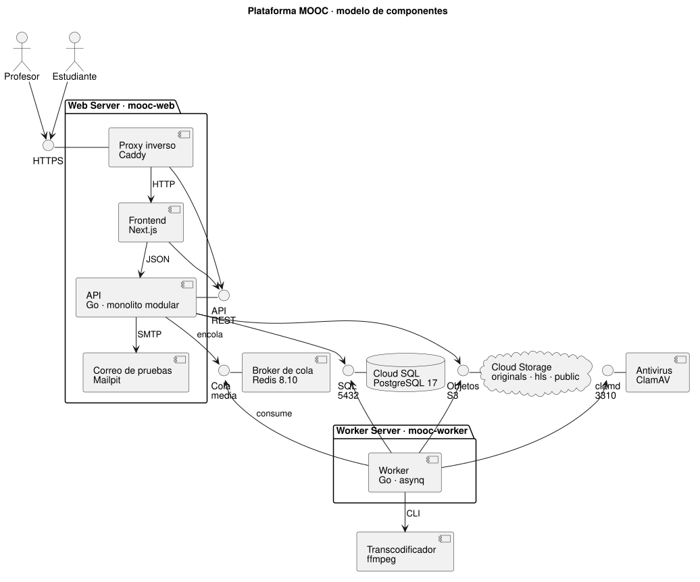
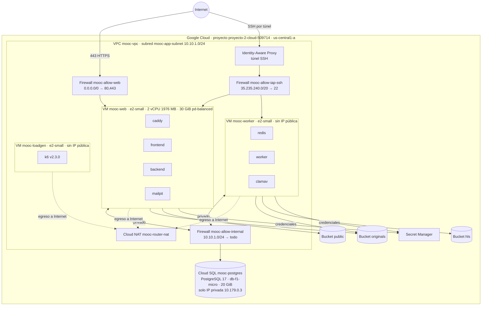
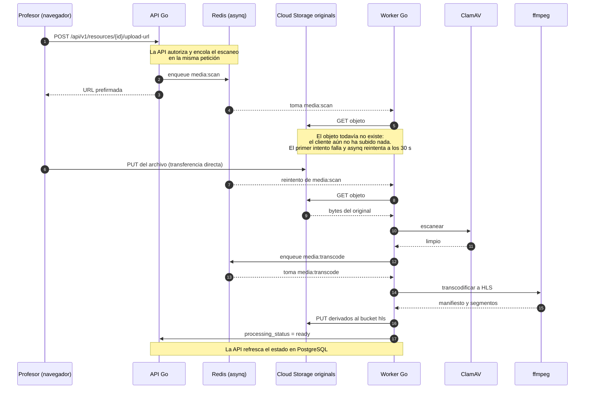
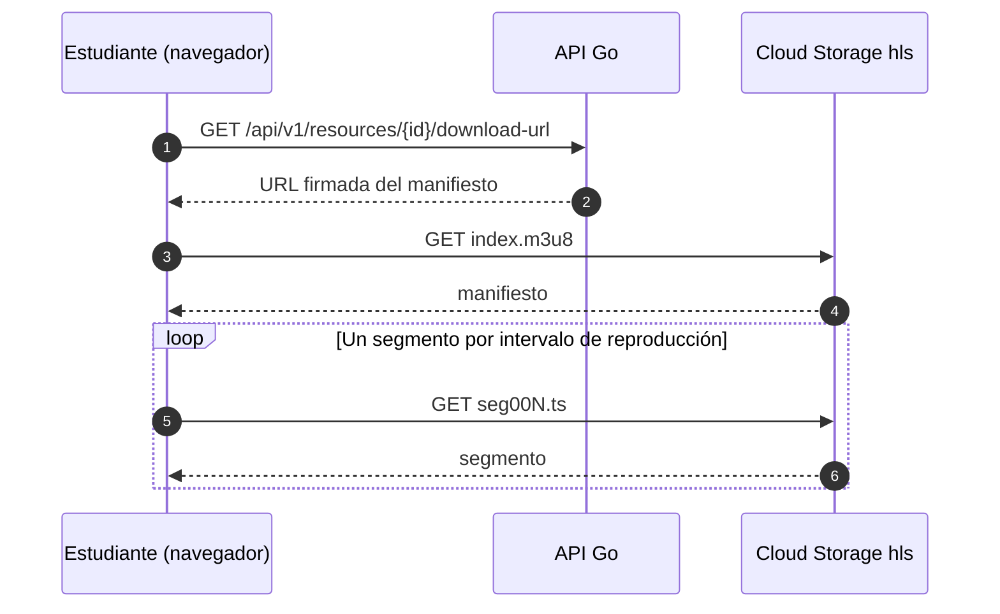
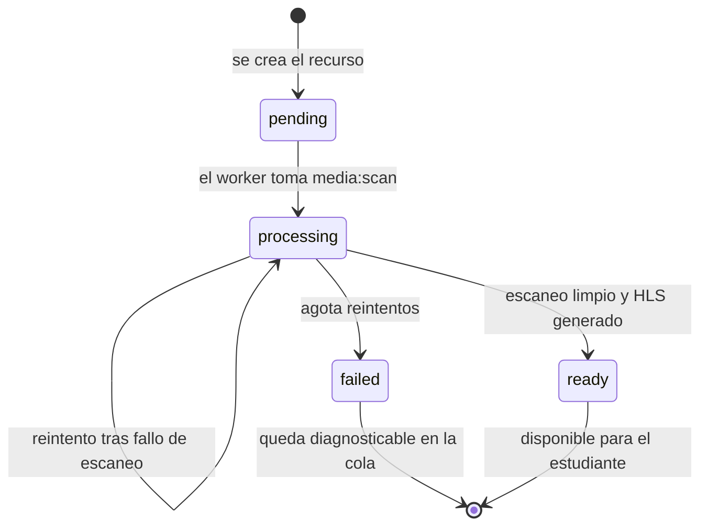
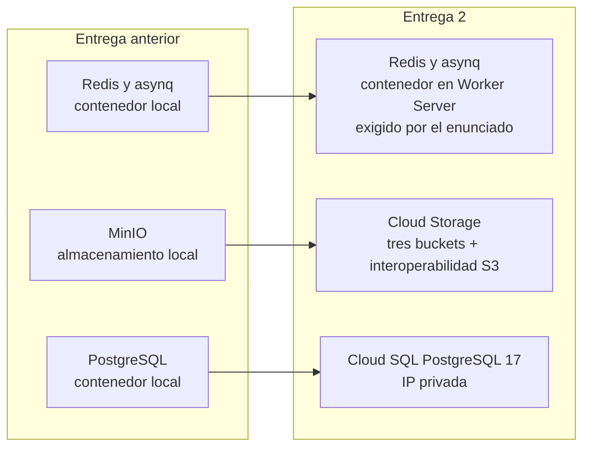

# Arquitectura desplegada (Entrega 2)

Diagramas de la solución tal como quedó desplegada en Google Cloud. El código fuente de cada diagrama es el bloque Mermaid, que se renderiza directamente en GitHub y en cualquier visor compatible.

## Componentes

Diagrama de componentes UML. Las interfaces provistas se dibujan como lollipops junto al componente que las ofrece, y cada flecha es una dependencia con el nombre de la interfaz que consume. El código fuente es `diagramas/componentes.puml` y se regenera con PlantUML.

La API es un monolito modular en Go. Los módulos son `auth`, `admin`, `courses`, `enroll`, `quiz`, `progress`, `badges`, `uploads`, `storage`, `mail`, `queue` y `telemetry`. El frontend Next.js se reutiliza de la entrega anterior y Caddy lo sirve junto con la API bajo el mismo origen, lo que evita configurar CORS.

Las comunicaciones síncronas son HTTP entre el navegador y Caddy, y HTTP interno entre Caddy y la API o el frontend. El worker habla con PostgreSQL y con Cloud Storage. Las asíncronas pasan por Redis con asynq, y son las dos únicas tareas de la aplicación, `media:scan` y `media:transcode`.

## Despliegue

La IP pública la tiene solo el Web Server, que es el punto de entrada. El Worker Server y el generador no tienen IP pública y se administran por SSH a través de IAP. Cloud SQL no acepta conexiones desde Internet porque tiene la IPv4 deshabilitada y solo expone la IP privada. Las tres máquinas salen a Internet por Cloud NAT para instalar dependencias. Los volúmenes persistentes son los discos de arranque de cada VM, con `redis_data` como volumen Docker para el `appendonly` de Redis.

## Carga directa de un archivo

Este es el flujo que el informe documenta con una condición de carrera. El encolado del escaneo ocurre antes de que el objeto exista, así que el primer intento falla por clave inexistente y el trabajo se resuelve en el reintento. La corrección consiste en separar la autorización de la confirmación, con un endpoint de confirmación que encole el escaneo una vez terminada la subida.

## Consumo de contenido

El contenido multimedia no pasa por la API. El navegador lo pide directo a Cloud Storage con una URL firmada, y el tráfico de control contra la API se limita a autorizar la descarga.

## Ciclo de vida del recurso

Un recurso en `failed` no se publica. El sistema lo conserva en lugar de perderlo, que es lo que el enunciado pide verificar en el drenaje.

## Decisiones y adaptaciones

Los cambios frente a la entrega anterior son tres. Redis se mantiene en contenedor y se mueve al Worker Server, porque el enunciado exige que el sistema de mensajería viva en un contenedor de esa máquina. El almacenamiento local se reemplaza por Cloud Storage, conservando la organización lógica de los objetos y los flujos de carga directa y URL firmada. PostgreSQL sale del contenedor y pasa a Cloud SQL, con la conexión restringida a la IP privada.

Del modelo de despliegue básico del enunciado quedan fuera el escalado automático, el balanceador de carga, las réplicas entre máquinas y la alta disponibilidad. La configuración de cómputo es fija durante las corridas de capacidad, que es lo que permite comparar niveles entre sí.
